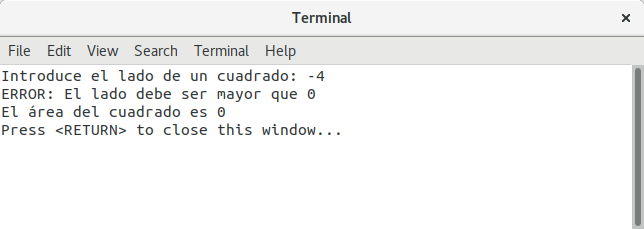

# Práctica I

## Ejercicio I - El cuadrado

### Paso I - Calcula el área de un cuadrado

**¿Dónde consultar?** 
  - [Lección 1 - Hola Mundo](https://codebin.cc/2018/09/16/leccion-1-hola-mundo/)

Escribe un programa que pida al usuario la longitud del lado de un cuadrado y a continuación escriba por pantalla su área (lado * lado).

Un ejemplo de programa en ejecución sería el que se muestra en la siguiente imagen

### Paso II - Verifica que el lado tiene una longitud mayor que cero

**¿Dónde consultar?** 
  - [Lección 3 - Condicionales](https://codebin.cc/2018/09/16/leccion-3-entrada-de-datos-por-el-usuario-condicionales/)

Mejora el programa anterior verificando que el valor introducido por el usuario es mayor que 0.

Un ejemplo de programa en ejecución sería el que se muestra en la siguiente imagen

### Paso III - Haciéndolo con clases

**¿Dónde consultar?** 
  - [Lección 2 - Mi Primera Clase](https://codebin.cc/2018/09/16/leccion-2-programando-la-primera-clase/)
  - [Lección 4 - Funciones Getter y Setter](https://codebin.cc/2018/09/23/leccion-4-funciones-getter-y-setter/)

Escribe una clase llamada *Cuadrado* que tenga:
  - Un atributo privado de tipo entero llamado *lado*
  - Un constructor que tome un parámetro de tipo entero para asignar valor la *lado*
  - Una función miembro getter *getArea()* que devuelva el el área del cuadrado.
  
  La función main de nuestro programa debe ser:

  
	int main()
	{
		int lado;
		cout << "Introduce el lado de un cuadrado: " ;
		cin >> lado;
		if(lado <= 0){
			cout << "El lado debe ser mayor que 0" << endl;
			return 1;
		}else{
			Cuadrado miCuadrado{lado};
			cout << "El área del cuadrado es " << miCuadrado.getArea() << endl;
		}
		return 0;
	}
	
### Paso IV - Comprobando si los datos son correctos en el constructor.

**¿Dónde consultar?** 
  - [Lección 3 - Condicionales](https://codebin.cc/2018/09/16/leccion-3-entrada-de-datos-por-el-usuario-condicionales/)

Realiza la verificación de que la longitud del lado sea mayor que 0 dentro del constructor. Si es menor o igual a 0 debe asignar al lado el valor 0 (el área será por tanto 0).

La función main sería en este caso:

	int main()
	{
		int lado;
		cout << "Introduce el lado de un cuadrado: " ;
		cin >> lado;
		Cuadrado miCuadrado(lado);
		cout << "El área del cuadrado es " << miCuadrado.getArea() << endl;

		return 0;
	}

Un ejemplo de programa de ejecución sería:

### Paso V - Gestión de errores con excepciones

**¿Dónde consultar?** 
  - [Lección 5 - Gestión de errores con excepciones](https://codebin.cc/2018/09/16/leccion-5-gestion-de-errores-con-excepciones/)

Modificar elconstructor para que si la longitud del lado es menor o igual que 0 el programa lance una excepción de tipo string con el mensaje "ERROR: El lado debe ser mayor que 0.

La función main debería quedar del siguiente modo:

	int main()
	{
		try{
			int lado;
			cout << "Introduce el lado de un cuadrado: " ;
			cin >> lado;
			Cuadrado miCuadrado(lado);
			cout << "El área del cuadrado es " << miCuadrado.getArea() << endl;
		}catch(string e){
			cout << e << endl;
			return 1;
		}

		return 0;
	}
	
### Paso VI - Dibujando el cuadrado
**¿Dónde consultar?** 
  - [Lección 6 - El bucle for](https://codebin.cc/2018/09/16/leccion-6-el-bucle-for/)

Introduce la siguiente función en la clase cuadrado

    void dibujaCuadrado(){
        for (int i{0}; i < lado ; i++){
            for (int j{0}; j < lado; j++){
                cout << "**";
            }
            cout << endl;
        }
    }
    
Haz el siguiente main

	int main()
	{
		try{
			int lado;
			cout << "Introduce el lado de un cuadrado: " ;
			cin >> lado;
			Cuadrado miCuadrado(lado);
			cout << "El área del cuadrado es " << miCuadrado.getArea() << endl;
			cout << endl << "Este es tu cuadrado:" << endl << endl;
			miCuadrado.dibujaCuadrado();
			cout << endl;
		}catch(string e){
			cout << e << endl;
			return 1;
		}

		return 0;
	}

¿Qué sale por pantalla cuándo lo ejecutas?

## Ejercicio II - El rectángulo

Repetir el ejercicio con un rectángulo (tiene 2 lados diferentes: lado1 y lado2)

## Ejercicio III - El triángulo

Repetir el ejercicio con un triángulo (se recomienda pedir base y altura)

