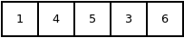

# std::array

En esta sección estudiaremos los *arrays*. Los *arrays* son una serie ordenada de datos de un tipo determinado. Un *array* se caracteriza porque al declararlo debemos indicar su tamaño (cuántos datos tendrá asociados) y el tipo de dato. Por ejemplo, podríamos decir: *mi array tiene 7 números enteros*, ya que estamos indicando el tamaño: 7, y el tipo de dato: entero.

Hay distintos modos de trabajar con *arrays* en C++. Aquí trabajaremos con el tipo `std::array` de la bibliteca estándar de C++ dado que es el tipo recomendado en C++ moderno.

## Declaración de un std::array
La declaración de un `std::array` tiene la siguiente estructura

```cpp
#include <array>

std::array<tipo,tamaño> nombre;
```
Recordemos que esto responde al modo genérico de declarar una variable `TIPO nombre{valor};` sabiendo que el valor inicial es opcional (salvo que la variable sea constante `const`).

## Inicialización de un std::array
Para inicializar un `std::array` indicaremos sus valores entre llaves y separados por comas.

```cpp
#include <array>

std::array<int,5> arr{1,4,5,3,6};
```

<p align="left">

</p>


También se puede inicializar con el operaodr `=`

```cpp
#include <array>

std::array<int,5> arr = {1,4,5,3,6};
```

## Lectura y asignación de los elementos de un std::array

Los elementos de un *array* son accesibles a través de su índice (posición). La cuenta de la posición empieza en 0, de modo que el primer elemento tendrá el índice 0 y el último el índice *(tamaño - 1)*.
La lectura y escritura de los elementos de un *array* se puede realizar de dos modos.

### Función at

```cpp
#include <array>

int main(){
  std::array<int,5> arr = {1,4,5,3,6};
  // acceso al valor asociado
  std::cout << arr.at(3) << "\n; // -> 5

  // modificacion del valor asociado
  arr.at(3) = 10;
  std::cout << arr.at(3) << "\n; // -> 10

  return 0;
}

```

### Operador []

```cpp
#include <array>
#include <iostream>

int main(){
  std::array<int,5> arr = {1,4,5,3,6};
  // acceso al valor asociado
  std::cout << arr[3] << "\n"; // -> 5

  // modificacion del valor asociado
  arr[3] = 10;
  std::cout << arr[3] << "\n"; // -> 10

  return 0;
}

```

## Funciones del tipo std::array

### front y back
Accede al primer y último elemento de un array.

```cpp
#include <array>
#include <iostream>

int main(){
  std::array<int,5> arr = {1,4,5,3,6};
  // acceso al valor asociado
  std::cout << arr.front() << "\n"; // -> 1

  // modificacion del valor asociado
  arr.back() = 10;
  std::cout << arr.back() << "\n"; // -> 10

  return 0;
}

```

### size
Devuelve el número de elementos del array
```cpp
#include <array>
#include <iostream>

int main(){
  std::array<int,5> arr = {1,4,5,3,6};
  std::cout << arr.size() << "\n"; // -> 5

  return 0;
}

```

### fill
Rellena el array con un valor específico

```cpp
#include <array>
#include <iostream>

int main(){
  std::array<int,20> arr;
  arr.fill(20); // todos los elementos son 20

  std::cout << arr.at(7) << "\n"; // -> 20
  return 0;
}
```

Al igual que los `std::string`, `std::set` y `std::vector` el `std::array` puede ser recorrido por un bucle [`for(auto elem :arry)`](../flujo/forelem.md).

## Para completar
  * [Referencia del tipo string](http://www.cplusplus.com/reference/array/array/)
