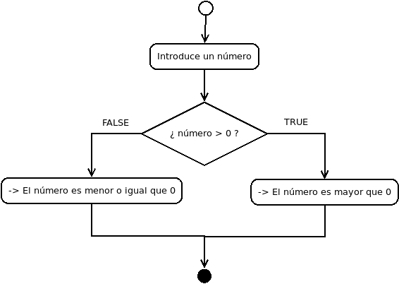
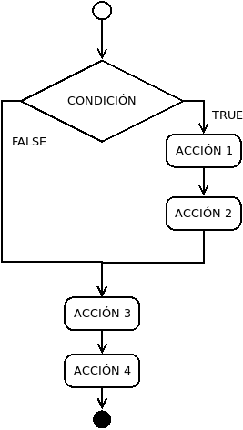
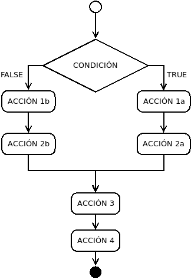
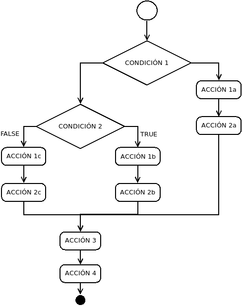

# Condicionales - if else

Un programa donde no hubiera control de flujo tendría esta estructura:
<p align="center">

</p>

Por ejemplo

```cpp
#include <iostream>

int main() {
  int number;
  std::cout << "Introduce un numero\n"; // Accion 1
  std::cin >> number; // Accion 2
  std::cout << "El numero es " << number << "\n"; // Accion 3
}
``` 

Sin embargo, lo habitual en un programa es que se tome distintos caminos en función del valor que puedan tener los datos, por ejemplo.
<p align="center">

</p>

Eso se consigue con los condicionales. 

## if

La estructura más simple de un condicional es:

```cpp
if(condicion){
  // Accion 1
  // Accion 2
}

Accion 3
Accion 4
```
<p align="center">

</p>

Un ejemplo sería

```cpp
#include <iostream>

int main() {
  int number;
  std::cout << "Introduce un numero positivo\n";
  std::cin >> number;
  if(number < 0){
    std::cout << "Te he dicho que debe ser positivo\n";
  }

  std::cout << "Gracias\n";
  return 0;
  
}
```

## if-else

El condicional también puede marcar 2 vías alternativas

```cpp
if(condicion){
  // Accion 1a
  // Accion 2a
}else{
  // Accion 1b
  // Accion 2b
}

Accion 3
Accion 4
```

<p align="center">

</p>

Un ejemplo sería

```cpp
#include <iostream>

int main() {
  int number;
  std::cout << "Introduce un numero\n";
  std::cin >> number;
  if(number < 0){
    std::cout << "El número es negativo\n";
  }else{
    std::cout << "El número es positivo\n";
  }

  std::cout << "Soy super listo\n";
  return 0;
}
```

## if - else if - else

El condicional puede marcar _n_ vías alternativas

```cpp
if(condicion 1){
  // Accion 1a
  // Accion 2a
}else if(condicion 2){
  // Accion 1b
  // Accion 2b
}else if(condicion 3){
  // Accion 1c
  // Accion 2c
}else{
  // Accion 1d
  // Accion 2d
}

Accion 3
Accion 4
```

<p align="center">

</p>

Un ejemplo sería

```cpp
#include <iostream>

int main() {
  int number;
  std::cout << "Introduce un numero\n";
  std::cin >> number;
  if(number < 0){
    std::cout << "El número es negativo\n";
  }else if (number < 5){
    std::cout << "El número es positivo y menor que 5\n";
  }else if (number < 10){
    std::cout << "El número es positivo y menor que 10\n";
  }else{
    std::cout << "El número es mayor que 10\n";
  }

  std::cout << "Soy super listo\n";
  return 0;
}
```

**¿Por qué este ejemplo de código no funciona como se esperaría?**

```cpp
#include <iostream>

int main() {
  int number;
  std::cout << "Introduce un numero\n";
  std::cin >> number;
  if(number > 10){
    std::cout << "El numero es mayor que 10\n";
  }else if(number < 10){
    std::cout << "El número es menor que 10\n";
  }else if (number < 5){
    std::cout << "El número es es menor que 5\n";
  }else if (number < 0){
    std::cout << "El número es negativo\n";
  }

  std::cout << "Esta vez la he cagado\n";
  return 0;
}
```

## Operadores de igualdad y desigualdad

|**Operador**|**Siginificado**   	|
|:--------:	|:-----------------:	|
|    ==    	|     Igual que     	|
|    !=    	|    Distinto que   	|
|     >    	|     Mayor que     	|
|     <    	|     Menor que     	|
|    >=    	| Mayor o igual que 	|
|    <=    	| Menor o igual que 	|

## Composición de operaciones booleanas

|   **Condición**   | **Siginificado** |
| :---------------: | :--------------: |
|  cond1 && cond 2  |  cond1 Y cond2   |
| cond 2 \|\| cond2 |  cond1 Y cond2   |
|      !cond1       |     NO cond1     |