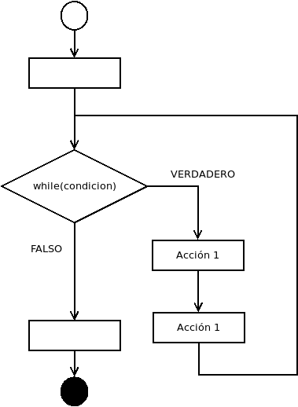

# Bucles - while

Los bucles son instrucciones de control de flujo que permiten que varias sentencias de un programa se ejecuten repetidamente en función en una condición.

En particular, el bucle `while` permite que un conjuntos de instrucciones se repitan mientras una condición sea verdadera.

Aquí vemos cuál sería su diagrama de flujo:

<p align="center">

</p>

Mientras la condicion es verdadera, se ejecutan las acciones _acción 1_ y _acción 2_. Cuando la condición es falsa el programa sigue normalmente.

La sintaxis general del bucle `while` es la siguiente:

```
while(condicion){
  // action 1
  // action 2
}
```

Por ejemplo:

```
#include <iostream>

int main() {
  int num;
  std::cout << "Introduce el número 3: ";
  std::cin >> num;

  while(num != 3){
    std::cout << "Te he dicho que introduzcas el 3\n";
    std::cout << "Vuelve a intentarlo: ";
    std::cin >> num;
  }

  std::cout << "Por fin has introducido el 3\n";
}
```

Este programa estará dentro del bucle hasta que el usuario introduzca por teclado el número 3. Una vez introducido el número 3 saldrá del bucle `while` y mostrará por pantalla `Por fin has introducido el 3`

¿Qué mostraría por pantalla el siguiente programa si el usuario introduce un 4?

```
#include <iostream>

int main() {
  int num;
  std::cout << "Introduce un número: ";
  std::cin >> num;
  int resultado = num;

  while(num > 1){
    num--;
    resultado = resultado * num;
  }

  std::cout << "El resultado es " << resultado << "\n";
}
```
