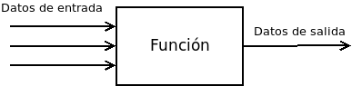

# Funciones con parámetros

Las funciones con parámetros permiten interactuar con el resto de datos de un programa. Se podría decir que _el flujo_ de una función es:

<p align="center">

</p>

donde

  * los datos de salida son el **valor de retorno**
  * los datos de entrada son los **parámetros**

La sintaxis general de una función con parámetros es la siguiente:

```cpp
tipo_retorno nombre_funcion(tipo_param1 param1, tipo_param2 param2, ... , tipo_param_n param_n){
  // codigo de la funcion
}
```

Por ejemplo, ¿cuál sería el tipo del valor de retorno de una función de suma dos números enteros?: un `int`, ¿cuáles serían los parámetros de una función de suma dos números enteros?, dos `int`.

Por lo tanto, la definición de una función `suma` sería:

```cpp
int suma(int num1, int num2){
  return num1 + num2;
}
```

Vamos a ver qué pasaría en el siguiente programa:
```cpp
#include <iostream>

int suma(int a, int b){
  return a+b;
}

int main() {  
  int num1, num2;
  std::cout << "Introduce un numero: ";
  std::cin >> num1;
  std::cout << "Introduce otro número: ";
  std::cin >> num2;

  int resultado = suma(num1, num2);

  std::cout << "La suma de los dos números es: " << resultado << "\n";
  
  return 0;
}
```
Un programa **siempre** empieza por la función principal `main`.

 1. Se crean 2 variables/etiquetas `num1` y `num2` dentro del ámbito de la función `main`.
 2. Se muestra por pantalla: `Introduce un número: `
 3. Se asocia a la variable `num1` el número entero que el usuario introduzca por teclado.
 4. Se muestra por pantalla: `Introduce otro número: `
 5. Se asocia a la variable `num2` el número entero que el usuario introduzca por teclado.
 6. Se crea una variable/etiqueta, que se asociará a un `int` llamada `resultado`. Pertenece al ámbito de la función `main`.
 7. Se comprueba si existe una función llamada `suma` que devuelva un `int` (para asociar a la etiqueta `resultado`) y que tome como parámetros dos `int`: `num1` y `num2`. **Existe**.
 8. Se entra en la función `suma` pasándole como parámetros los valores asociados a `num1` y `num2`.
    1. Se crean 2 variables/etiquetas `a` y `b` **dentro del ámbito de la función `suma`**
    2. Se asocian con **una copia** de los valores que tienen `num1` y `num2`. **Importante** no se asocia con el mismo valor que hay en memoria, sino que se crea **una copia** de ese valor en **otro lugar de la memoria**. Por lo tanto, aunque `a` tiene el mismo valor que `num1` y `b` el mismo valor que `num2`, **los valores en memoria son independientes**.
    3. Se devuelve el valor de la suma de `a` y `b`.
    4. Se destruyen las variables/etiquetas `a` y `b` y se libera el espacio en memoria de sus valores asociados.
 9. La variable `resultado` es asociada **con una copia** del valor devuelto. Del mismo modo que al pasar los parámetros se realiza una copia de los valores, el valor de retorno también se pasa como **copia**.
 10. Se muestra por pantalla el valor de la suma.
 11. Finaliza el programa devolviendo al sistema el valor `0`.

Los parámetros pueden ser de cualquier tipo, por ejemplo, la siguiente función imprimiría por pantalla los elementos de un `std::vector` (y no devolvería ningún valor)

```cpp
void print(std::vector<int> vec){
  for (auto elem: vec){
    std::cout << elem << "-"
  }
}
```

## Paso de parámetros por referencia

Como se ha visto, cuando se pasan parámetros a una función, lo valores de las variables se deben copiar del ámbito de la función desde donde se llama (por ejemplo `main`) al ámbito de la función llamada (por ejemplo `suma`). Al realizar esta copia se invierte tiempo y se ocupa memoria.

Por ejemplo, en al función `print` anterior, cada vez que es llamada, se debe copiar el vector que se pasa por parámetros. Si este vector tuviera cientos de miles de datos esto llevaría tiempo (extremadamente pequeño en un ordenador moderno) y ocuparía memoria. Si la función `print` fuera llamada cientos de miles de veces a lo largo del programa, el impacto en tiempo sí podría notarse y afectar al rendimiento del programa.

¿Cómo se soluciona esto? Pasando los parámetros por referencia. Cuando un parámetro se pasa por referencia, no se realiza una copia del valor, sino que el parámetro **se asocia al mismo valor (en memoria)** que la variable.

Para pasar los parámetros por referencia se deben declarar del siguiente modo:

```cpp
tipo_retorno nombre_funcion(tipo_param1 & param1, tipo_param2 & param2, ... , tipo_param_n & param_n){
  // codigo de la funcion
}
```

Por ejemplo, si retomamos el ejemplo de la función `suma`, pero pasando los parámetros por referencia:

```cpp
#include <iostream>

int suma(int & a, int & b){
  return a+b;
}

int main() {  
  int num1, num2;
  std::cout << "Introduce un numero: ";
  std::cin >> num1;
  std::cout << "Introduce otro número: ";
  std::cin >> num2;

  int resultado = suma(num1, num2);

  std::cout << "La suma de los dos números es: " << resultado << "\n";
  
  return 0;
}
```

 1. Se crean 2 variables/etiquetas `num1` y `num2` dentro del ámbito de la función `main`.
 2. Se muestra por pantalla: `Introduce un número: `
 3. Se asocia a la variable `num1` el número entero que el usuario introduzca por teclado.
 4. Se muestra por pantalla: `Introduce otro número: `
 5. Se asocia a la variable `num2` el número entero que el usuario introduzca por teclado.
 6. Se crea una variable/etiqueta, que se asociará a un `int` llamada `resultado`. Pertenece al ámbito de la función `main`.
 7. Se comprueba si existe una función llamada `suma` que devuelva un `int` (para asociar a la etiqueta `resultado`) y que tome como parámetros dos `int`: `num1` y `num2`. **Existe**.
 8. Se entra en la función `suma` pasándole como parámetros los valores asociados a `num1` y `num2`.
    1. Se crean 2 variables/etiquetas `a` y `b` **dentro del ámbito de la función `suma`**
    2. Se asocian con los valores que tienen `num1` y `num2`. **Importante** se asocian con el mismo valor que hay en memoria, NO que se crea **una copia** de ese valor en **otro lugar de la memoria**. Por lo tanto, `a` está asociada al mismo valor que `num1` y `b` al mismo valor que `num2`, si por lo tanto modificase `a` dentro de la función, se modificaría `num1`, y lo mismo con `b`.
    3. Se devuelve el valor de la suma de `a` y `b`.
    4. Se destruyen las variables/etiquetas `a` y `b`
 9. La variable `resultado` es asociada **con una copia** del valor devuelto. El valor de retorno se pasa como **copia** a `resultado`.
 10. Se muestra por pantalla el valor de la suma.
 11. Finaliza el programa devolviendo al sistema el valor `0`.

## Problemática de los parámetros por referencia

Se ha visto que una función nunca debería tener efectos colaterales, es decir, modificar variables que no pertenecen al ámbito de la función.

Sin embargo, al pasar un parámetro por referencia, es posible modificar la variable pasada. Aunque C++ permiete esto (al igual que modificar una variable global), esto no se debería realizar nunca *(esta opinión puede ser discutida y otros programadores podrían no estar de aucerdo, se basa en uno de los principios fundamentales de la programación funcional respsecto a los efectos colaterales)*

En el siguiente programa se muestra un ejemplo de efecto colateral que no debería suceder:

```cpp
#include <iostream>

void multiplicaPorDos(int & a){
  a = a*2;
}

int main() {  
  int num = 3;
  multiplicaPorDos(num);
  std::cout << num; // -> 6
  return 0;
}
```

 1. Se declara una variable/etiqueta y se asocia al valor 3
 2. Se llama a la función `multiplicaPorDos` pasando la referencia a la variable `num`
    1. Se crea la variable/etiqueta `a` y se asocia al mismo valor (misma dirección en memoria) que `num`.
    2. Se modifica `a` (su valor se multiplica x 2). Colateralmente `num` también se multpilica por 2, dado que ambas variables/etiquetas están asociadas con el mismo valor.
    3. Se elimina la etiqueta `a`(su valor en memoria permanece)
 3. Se muestra por pantalla `num` que ahora vale 6.


**Esto nunca devería suceder**, porque `multiplicaPorDos` está modificando una variable que está fuera de su ámbio `num`. ¿Cuál sería el modo correcto de realizar este programa?

```cpp
#include <iostream>

void multiplicaPorDos(int a){
  a = a*2;
  return a;
}

int main() {  
  int num = 3;
  num = multiplicaPorDos(num);
  std::cout << num; // -> 6
  return 0;
}
```
En este caso, la función NO modifica ninguna variable que esté fuera de su ámbito (ya que `a` está asociado a una copia de `num`). Para modificar `num` lo hacemos a través del valor de retorno de la función. Es decir, respetamos la estructura de las funciones y los principio de la programación funcional:

 * Una función recibe parámetros del exterior a través de sus parámetros.
 * Una función realiza operaciones con los valores recibidos sin modificar las variables externas.
 * Una función proporciona datos al exterior a través del valor de retorno.

### ¿Cuándo pasar valores por referencia?

Por lo que se ha visto anteriormente hay 2 objetivos para pasar valores por referencia:

  * Ahorro de memoria, al no tener que duplicar los datos.
  * Ahorro de tiempo, al no tener que realizar la operación de copia de los datos.
  
En el caso de lo que hemos llamado tipos simples: `int`, `float`, `char`, `bool`, etc. esto no aplica, dado que el hecho de pasar la referencia tiene la misma carga que la de pasar el valor. Por lo tanto, los timpos simples (_primitivas_) siempre se pasarán **por copia**

En el caso de lo que hemos llamado tipos complejos: `struct`, `std::string`, `std::vector`, etc. siempre los pasáremos por referencia, dado que en este caso el ahorro de tiempo y de memoria sí puede ser considerable.

¿Y cómo se soluciona el problema de no "modificar" los parámetros pasados por referencia? Aunque podríamos hacer un pacto de caballeros de que eso nunca va a suceder, el mejor modo de hacerlo es pasar el parámetro como referencia constante, lo que impide que sea modificada.

Por ejemplo:

```cpp
void foo(std::vector<int> const & vec ){
  vec.at(0) = 5; // Error de compilacion, no se puede modificar una referencia constante
}
```

### ¿Cómo hacer una función que modifique un vector?

Imaginemos, por ejemplo que queremos hacer una función que multiplique todos los elementos de un vector por 2.

Según todo lo dicho hasta ahora, se debería hacer del siguiente modo

```cpp
#include <iostream>
#include <vector>

std::vector<int> multiplicaPorDos(std::vector<int> const & vec){
  std::vector<int> result;
  for(auto elem: vec){
    result.push_back(elem * 2);
  }
  return result;
}

void printVector(std::vector<int> const & vec){
  for(auto elem: vec){
    std::cout << elem << "-";
  }
  std::cout << std::endl;
}

int main() {  
  std::vector<int> numeros{3,5,6};
  printVector(numeros); // -> 3-5-6-
  numeros = multiplicaPorDos(numeros);
  printVector(numeros); // -> 6-10-12-
  return 0;
}
``` 